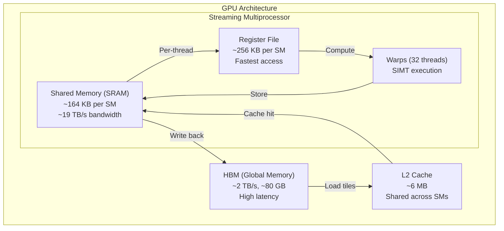
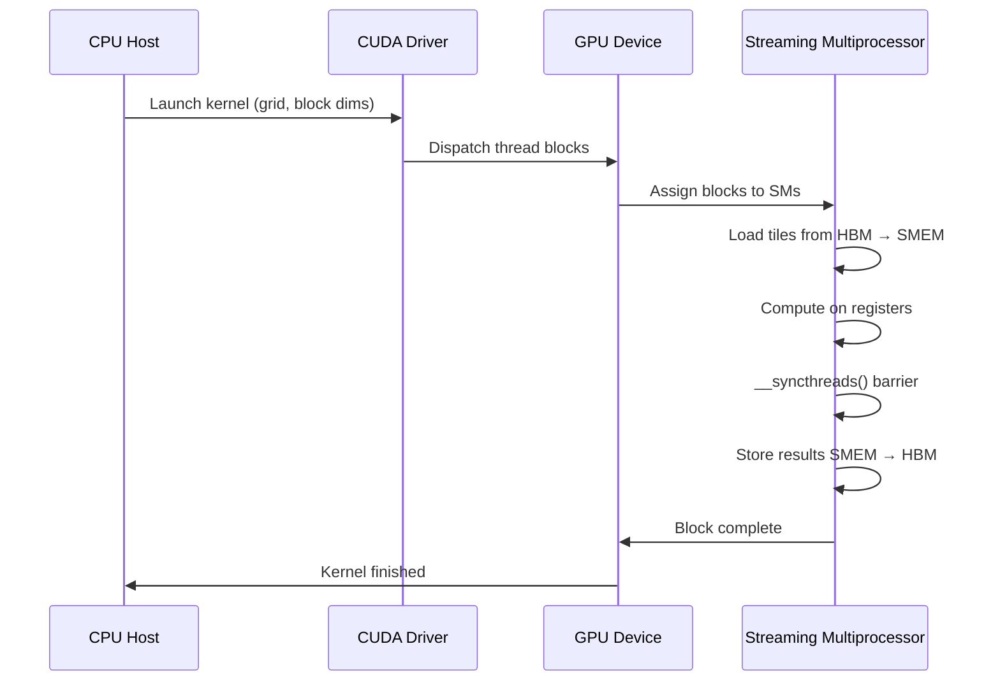
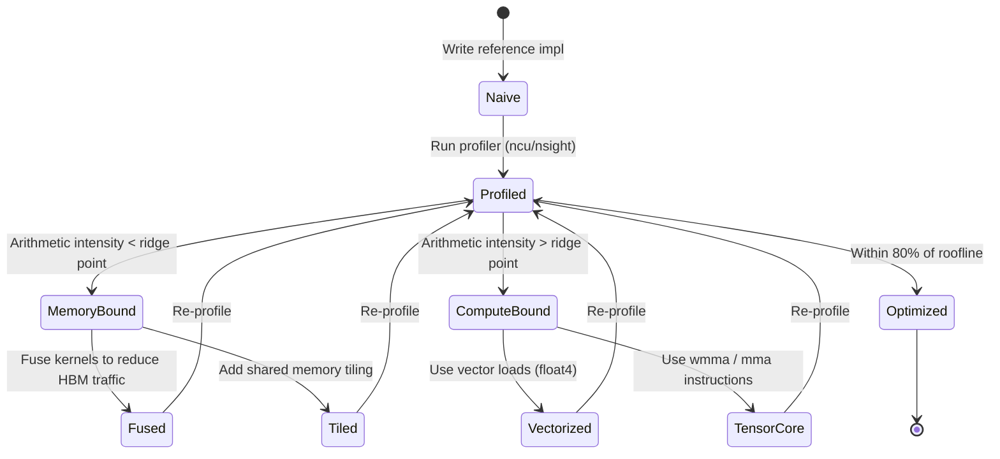

# Custom CUDA Kernels & Triton GPU Programming

Hand-written CUDA kernels and Triton implementations for core deep learning operations — fused attention, matrix multiplication, LayerNorm, softmax, and custom activations — benchmarked against PyTorch native ops with roofline model analysis.

## Theory & Background

### Why Custom Kernels Matter

Modern deep learning workloads are bottlenecked not by compute but by memory bandwidth. A standard Transformer layer calls dozens of separate CUDA kernels: one for matrix multiply, one for softmax, one for dropout, one for residual add. Each kernel launch reads from and writes to global GPU memory (HBM), which is orders of magnitude slower than on-chip SRAM. The key insight behind kernel fusion is simple: if two operations share the same data, compute them in the same kernel and keep intermediate results in fast registers or shared memory instead of round-tripping through HBM.

Triton is a Python-based DSL that compiles to GPU code (PTX), letting you write fused kernels without raw CUDA C++. It handles thread-block scheduling, memory coalescing, and register allocation while giving you explicit control over tiling and memory hierarchy. CUDA C++ remains essential for understanding the hardware model and for operations where you need full control over warp-level primitives.

### GPU Memory Hierarchy and Kernel Execution

The performance of any GPU kernel depends on how effectively it uses the memory hierarchy. Understanding this hierarchy is the foundation for writing fast kernels.



A kernel launch dispatches a grid of thread blocks. Each block runs on one SM and has access to that SM's shared memory. Threads within a block synchronize via barriers; threads across blocks cannot. This constraint shapes every algorithm: you must decompose your problem into independent tiles that fit in shared memory.

### The Roofline Model

The roofline model characterizes kernel performance by relating arithmetic intensity to hardware limits. Every kernel sits somewhere on this model, and understanding where tells you whether to optimize for compute or memory.

Arithmetic intensity $I$ is the ratio of floating-point operations to bytes moved:

```math
I = \frac{\text{FLOPs}}{\text{Bytes transferred}}
```

The roofline gives the maximum achievable performance $P$ as:

```math
P = \min\left(\pi, \beta \cdot I\right)
```

where $\pi$ is peak compute throughput (FLOP/s) and $\beta$ is peak memory bandwidth (bytes/s). The ridge point $I^* = \pi / \beta$ separates memory-bound kernels ($I < I^*$) from compute-bound kernels ($I > I^*$).

For example, elementwise operations like GELU have $I \approx 1$ FLOP/byte — deeply memory-bound. Matrix multiplication has $I \approx O(\sqrt{N})$ — compute-bound for large matrices. Fused softmax sits in between, and fusion pushes it toward the compute-bound regime by eliminating intermediate memory traffic.

### Kernel Execution Lifecycle

Every GPU kernel follows a predictable lifecycle from launch to completion. Understanding this flow reveals where optimization opportunities exist.



### Tiled Matrix Multiplication

Matrix multiplication is the workhorse of deep learning. The naive algorithm has $O(N^3)$ arithmetic but $O(N^2)$ memory accesses per output element if done carelessly. Tiling restructures the computation to reuse data loaded into shared memory.

For matrices $C = A \times B$ where $A \in \mathbb{R}^{M \times K}$ and $B \in \mathbb{R}^{K \times N}$, we partition the output into tiles of size $\text{BLOCK\_M} \times \text{BLOCK\_N}$. Each thread block computes one output tile by iterating over $K$ in chunks of $\text{BLOCK\_K}$:

```math
C_{ij} = \sum_{k=0}^{K/\text{BLOCK\_K} - 1} A_{i,k} \cdot B_{k,j}
```

Each iteration loads a $\text{BLOCK\_M} \times \text{BLOCK\_K}$ tile of $A$ and a $\text{BLOCK\_K} \times \text{BLOCK\_N}$ tile of $B$ into shared memory, computes the partial product, and accumulates. The data reuse ratio is $\text{BLOCK\_K}$ — each element of $A$ is used $\text{BLOCK\_N}$ times and each element of $B$ is used $\text{BLOCK\_M}$ times.

### Flash Attention

Standard attention computes $\text{Softmax}(QK^T / \sqrt{d}) \cdot V$, which materializes the full $N \times N$ attention matrix in HBM — $O(N^2)$ memory for sequence length $N$. Flash Attention avoids this by tiling the computation and using an online softmax algorithm that never stores the full matrix.

The online softmax maintains a running maximum $m$ and normalizer $\ell$ as it processes tiles:

```math
m_{\text{new}} = \max(m_{\text{old}},\; \max(\text{tile scores}))
```

```math
\ell_{\text{new}} = \ell_{\text{old}} \cdot e^{m_{\text{old}} - m_{\text{new}}} + \sum_j e^{s_j - m_{\text{new}}}
```

This reduces memory from $O(N^2)$ to $O(N)$ and achieves wall-clock speedups of 2-4x on long sequences by keeping all intermediates in SRAM.

### Kernel Optimization State Machine

Optimizing a GPU kernel is an iterative process. Each kernel goes through distinct phases as you profile and improve it.



### Tradeoffs: Triton vs CUDA C++

| Aspect | Triton | CUDA C++ |
|--------|--------|----------|
| Development speed | Fast — Python syntax, auto-tuning | Slow — manual thread/memory management |
| Portability | AMD + NVIDIA (via backends) | NVIDIA only (without HIP port) |
| Warp-level control | Limited — no direct warp shuffles | Full — warp primitives, inline PTX |
| Fusion flexibility | Excellent — natural to fuse ops | Manual — must manage shared memory |
| Peak performance | ~90-95% of handwritten CUDA | 100% (theoretical ceiling) |
| Debugging | Python tracebacks, print | cuda-gdb, compute-sanitizer |

For most deep learning kernels, Triton reaches within 5-10% of hand-tuned CUDA while being 5-10x faster to develop. CUDA C++ is still necessary for warp-level algorithms (parallel scan, ballot), custom memory allocators, and integration with existing C++ codebases.

### Key References

- Tillet et al., "Triton: An Intermediate Language and Compiler for Tiled Neural Network Computations" (2019) — [arXiv](https://arxiv.org/abs/1907.00587)
- Dao et al., "FlashAttention: Fast and Memory-Efficient Exact Attention with IO-Awareness" (2022) — [arXiv](https://arxiv.org/abs/2205.14135)
- Williams et al., "Roofline: An Insightful Visual Performance Model for Multicore Architectures" (2009) — [Paper](https://people.eecs.berkeley.edu/~kubitron/cs252/handouts/papers/RooflineVyworky.pdf)
- NVIDIA, "CUDA C++ Programming Guide" — [Docs](https://docs.nvidia.com/cuda/cuda-c-programming-guide/)

## Real-World Applications

Custom GPU kernels are the performance layer beneath every production AI system. When a model serves millions of requests per second, the difference between a fused and unfused kernel translates directly to infrastructure cost and user-perceived latency.

| Industry | Use Case | Impact |
|----------|----------|--------|
| Cloud AI Providers | Serving LLMs (GPT, Claude, Gemini) with fused attention kernels | 2-4x throughput improvement per GPU, reducing serving cost by 50%+ |
| Autonomous Vehicles | Real-time perception with fused conv + norm + activation pipelines | Meeting 10ms latency budgets for safety-critical inference |
| Financial Services | Low-latency risk computation with custom reduction kernels | Sub-millisecond portfolio risk updates for trading systems |
| Drug Discovery | Molecular dynamics with custom force-field kernels | 10x speedup on protein folding simulations, accelerating drug candidates |
| Video Streaming | Real-time super-resolution and encoding with fused upsampling kernels | 4K streaming at lower bitrates, saving CDN bandwidth costs |

Understanding kernel optimization is what separates ML engineers who deploy models from those who make them fast. Every major AI lab — and increasingly every company running inference at scale — needs engineers who can read a roofline plot and write a fused kernel.

## Project Structure

```
cuda-triton-kernels/
├── triton_kernels/
│   ├── __init__.py            # Package exports
│   ├── fused_softmax.py       # Fused softmax kernel
│   ├── matmul.py              # Tiled matrix multiplication
│   ├── layernorm.py           # Fused LayerNorm
│   ├── flash_attention.py     # Flash Attention in Triton
│   ├── gelu.py                # Fused GELU activation
│   └── rmsnorm.py             # RMSNorm kernel
├── cuda_kernels/
│   ├── vector_add.cu          # Basic CUDA vector add
│   ├── reduction.cu           # Parallel reduction
│   ├── tiled_matmul.cu        # Tiled matrix multiplication
│   └── build.py               # Build script for CUDA extensions
├── benchmarks/
│   ├── bench_attention.py     # Flash attention benchmarks
│   ├── bench_matmul.py        # Matmul benchmarks
│   └── roofline.py            # Roofline model analysis
├── notebooks/
│   └── walkthrough.ipynb      # Interactive kernel walkthrough
├── requirements.txt
└── README.md
```

## Quick Start

```bash
pip install -r requirements.txt

# Run Triton fused softmax (works on CPU with reference impl)
python triton_kernels/fused_softmax.py

# Run flash attention demo
python triton_kernels/flash_attention.py

# Benchmark matmul implementations
python benchmarks/bench_matmul.py

# Roofline model analysis
python benchmarks/roofline.py

# Build CUDA kernels (requires nvcc)
python cuda_kernels/build.py
```

## Implementation Details

### What makes this non-trivial

- **Online softmax in Flash Attention**: The tiled attention kernel maintains running statistics ($m$, $\ell$) across tiles, requiring careful numerical rescaling at each step. Getting the accumulator update wrong produces silently incorrect attention weights — the output looks plausible but is mathematically wrong.

- **Shared memory bank conflicts in tiled matmul**: The CUDA tiled matmul must pad shared memory arrays or use swizzled access patterns to avoid 32-way bank conflicts that serialize memory access within a warp. A naive implementation runs at 10-20% of peak; proper padding reaches 80%+.

- **Fused LayerNorm in one pass**: Computing mean and variance normally requires two passes over the data. The Welford online algorithm computes both in a single pass, halving memory traffic. The Triton kernel fuses this with the scale/shift affine transform.

- **Roofline-guided optimization**: The benchmark suite doesn't just measure throughput — it computes arithmetic intensity for each kernel and plots achieved performance against the hardware roofline, showing exactly whether a kernel is memory-bound or compute-bound and how much headroom remains.

- **CPU fallback architecture**: Every Triton kernel has a pure PyTorch reference implementation that produces identical results on CPU. This enables testing, debugging, and benchmarking without GPU access while keeping the Triton code as the production path.
